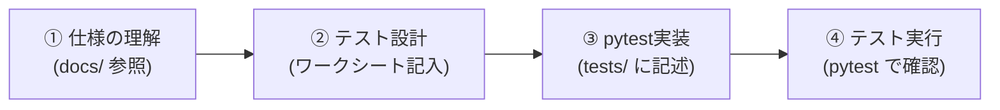

# 2048 テスト設計＆実装ハンズオン (`test-design-2048`)

本ハンズオンは、Pythonモジュール `pytest` の文法を覚えることではなく、**「何のために、何をテストすべきか」というテスト設計技法（同値分割・境界値分析・デシジョンテーブル・状態遷移テスト）を身につけること**を目的としています。

生成AIにコードを書かせる時代だからこそ、人間がテストの「境界」や「漏れ」を正しく設計するスキルが不可欠です。本教材を通じて、堅牢なテストコードを設計・実装するプロセスを習得しましょう。

---

## 1. ディレクトリ構成と学習の流れ

本リポジトリには、学習をサポートするドキュメントとワークシートが同梱されています。

```text
.
├── README.md               # 全体概要・環境構築ガイド
├── HANDS_ON.md             # 本ガイド（ハンズオン進行手順書）
├── docs/
│   ├── game_rules.md       # ゲーム「2048」のルール解説（移動・結合・スコア）
│   ├── design_spec.md      # 詳細設計書 兼 ロジック仕様書（アーキテクチャ・シーケンス・API）
│   ├── pytest_manual.md    # pytest クイックマニュアル（書き方・モック・コマンド）
│   └── worksheets/
│       └── test_design_worksheet.md  # テスト設計ワークシート（各Session演習用）
├── src/                    # テスト対象のプログラム（ドメインロジック）
│   ├── board_logic.py
│   ├── tile_generator.py
│   └── game_manager.py
└── tests/                  # テストコードを記述する領域
    ├── test_board_logic.py
    ├── test_tile_generator.py
    └── test_game_manager.py

```

---

## 2. ハンズオンの進め方（基本サイクル）

すべての Session は以下の3ステップで進めます。コードを書き始める前に、必ずワークシートで「設計」を行うのがポイントです。



---

## 3. 各セッションの学習内容と課題

### 🟢 Session 1: 同値分割・境界値分析

* **テーマ**: 入力値のグループ化と「境目」の洗い出し
* **対象機能**: `src/board_logic.py` (`slide_and_merge_line`, `is_board_full`)
* **事前インプット**: `docs/game_rules.md` の「結合ルール」、`docs/design_spec.md` の モジュール①

#### 実習課題

1. `docs/worksheets/test_design_worksheet.md` の **Section 1** を埋めてください。
* 1行（`line`）の入力における「有効同値」「無効同値」を整理する。
* 「1移動1合成の原則（連鎖しない）」を網羅するテスト条件を整理する。


2. 整理したテストケースを `tests/test_board_logic.py` に `pytest` で実装してください。
3. `@pytest.mark.parametrize` を活用して、効率的にデータ駆動テストを書いてみましょう。

---

### 🟡 Session 2: 組合せテスト（デシジョンテーブル）

* **テーマ**: 複数条件が複雑に絡み合う機能の網羅化
* **対象機能**: `src/game_manager.py` (`is_game_over`)
* **事前インプット**: `docs/design_spec.md` の モジュール③

#### 実習課題

1. `docs/worksheets/test_design_worksheet.md` の **Section 2** を埋めてください。
* ゲームオーバーを判定する3つの因子（空きマス・水平合成・垂直合成）を抽出する。
* 8パターンの条件組み合わせ（デシジョンテーブル）を作成し、期待値を記入する。


2. 抽出したパターンに対応する4×4の盤面データ（2次元配列）を作成します。
3. `tests/test_game_manager.py` にテストコードを実装し、全パターンを正しく判定できるか確認してください。

---

### 🔴 Session 3: 状態遷移テスト & モック（Mock）の活用

* **テーマ**: 時間的変化・状態変化のテストと不確定要素の制御
* **対象機能**: `src/tile_generator.py` (`spawn_tile`), ゲーム全体の進行状態
* **事前インプット**: `docs/design_spec.md` の シーケンス図、`docs/pytest_manual.md` の モック解説

#### 実習課題

1. `docs/worksheets/test_design_worksheet.md` の **Section 3** を埋めてください。
* 盤面の状態（初期・途中・満杯・詰み）とイベント（移動操作・タイル生成）の遷移図/表を作成する。


2. ランダムにタイルが生成される `spawn_tile` をテストするため、`unittest.mock.patch` を使用してランダム値を固定（モック化）するテストを記述してください。
3. 「盤面に変化がない操作時にはタイルが生成されない」という状態遷移の境界挙動を検証してください。

---

## 4. テスト実行・確認コマンド

準備ができたら、ターミナルで以下のコマンドを実行してテスト結果とカバレッジを確認します。

```bash
# すべてのテストを実行
pytest

# 詳細ログ（テスト関数名とPASS/FAIL）を表示
pytest -v

# カバレッジ（テストがコードのどこを通ったか）の計測
pytest --cov=src --cov-report=term-missing

```

すべてのテストが **GREEN（PASS）** になり、仕様通りの挙動が保証できたら完了です！
