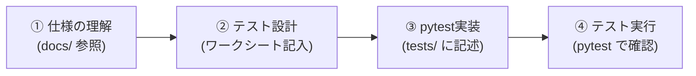

# 2048 テスト設計＆実装ハンズオン (`test-design-2048`)

本ハンズオンは、Pythonモジュール `pytest` の文法を覚えることではなく、**「何のために、何をテストすべきか」というテスト設計技法（同値分割・境界値分析・デシジョンテーブル・状態遷移テスト）を身につけること**を目的としています。

生成AIにコードを書かせる時代だからこそ、人間がテストの「境界」や「漏れ」を正しく設計するスキルが不可欠です。本教材を通じて、堅牢なテストコードを設計・実装するプロセスを習得しましょう。

---

## 1. ディレクトリ構成と学習の流れ

本リポジトリには、学習をサポートするドキュメントとワークシートが同梱されています。

```text
.
├── README.md               # 全体概要・環境構築ガイド
├── docs/
│   ├── HANDS_ON.md         # 本ガイド（ハンズオン進行手順書）
│   ├── game_rules.md       # ゲーム「2048」のルール解説（移動・結合・スコア）
│   ├── design_spec.md      # 詳細設計書 兼 ロジック仕様書（アーキテクチャ・シーケンス・API）
│   ├── pytest_manual.md    # pytest クイックマニュアル（書き方・モック・コマンド）
│   ├── session-*.md        # 各セッションの詳細ガイド（全6回）
│   └── worksheets/
│       └── participant_test_design_worksheet.md  # テスト設計ワークシート（演習用）
├── src/                    # テスト対象のプログラム（ドメインロジック）
│   ├── board_logic.py
│   ├── tile_generator.py
│   └── game_manager.py
└── tests/                  # テストコードを記述する領域
    ├── test_board_logic.py
    ├── test_tile_generator.py
    └── test_game_manager.py
```

---

## 2. ハンズオンの進め方（基本サイクル）

すべてのセッションは以下の4ステップで進めます。コードを書き始める前に、必ずワークシートで「設計」を行うのがポイントです。



---

## 3. 学習の大きな流れ

本ハンズオンでは、全6回のセッション（`session-1` 〜 `session-6`）を通じてテスト設計と実装を段階的に学びます。各課題の詳細は、対応する `session-*.md` ドキュメントを参照してください。

### フェーズ 1: 基本と単一条件のテスト (Session 1〜2)
* **テーマ**: 入力値のグループ化と「境目」の洗い出し
* **概要**: 仕様からテスト観点を抽出し、同値分割・境界値分析を用いてテストを設計する基本プロセスを学びます。
* **対応セッション**:
  * `session-1-introduction.md`: ユニットテストの基本とシンプルな機能（`is_board_full`）の仕様理解
  * `session-2-boundary-values.md`: 境界値分析と同値分割（スライド・合成ロジック `slide_and_merge_line`）

### フェーズ 2: 状態・モック・複雑な条件のテスト (Session 3〜4)
* **テーマ**: 不確定要素の制御と複数条件が複雑に絡み合う機能の網羅化
* **概要**: モックを使ったランダム要素や状態遷移のテスト方法、そしてデシジョンテーブルを用いて複雑な条件を整理する手法を学びます。
* **対応セッション**:
  * `session-3-mocks-and-stubs.md`: 状態遷移テスト & モック（Mock）の活用（ランダムなタイル生成 `spawn_tile`）
  * `session-4-decision-table.md`: 組合せテスト（デシジョンテーブル）（ゲームオーバー判定 `is_game_over`）

### フェーズ 3: 効率的な組み合わせとリファクタリング (Session 5〜6)
* **テーマ**: 組み合わせ爆発の防止とカバレッジを活用した改善
* **概要**: パラメータが多岐にわたる場合のPairwise法や、カバレッジを測定して安全にリファクタリングする実践的な手法を学びます。
* **対応セッション**:
  * `session-5-all-pairs.md`: Pairwise法（All-Pairs法）による組み合わせテスト
  * `session-6-coverage-refactoring.md`: コード網羅率（カバレッジ）とリファクタリング

---

## 4. テスト実行・確認コマンド

準備ができたら、ターミナルで以下のコマンドを実行してテスト結果とカバレッジを確認します。

```bash
# すべてのテストを実行
pytest

# 詳細ログ（テスト関数名とPASS/FAIL）を表示
pytest -v

# カバレッジ（テストがコードのどこを通ったか）の計測
pytest --cov=src --cov-report=term-missing
```

すべてのテストが **GREEN（PASS）** になり、仕様通りの挙動が保証できたら完了です！
