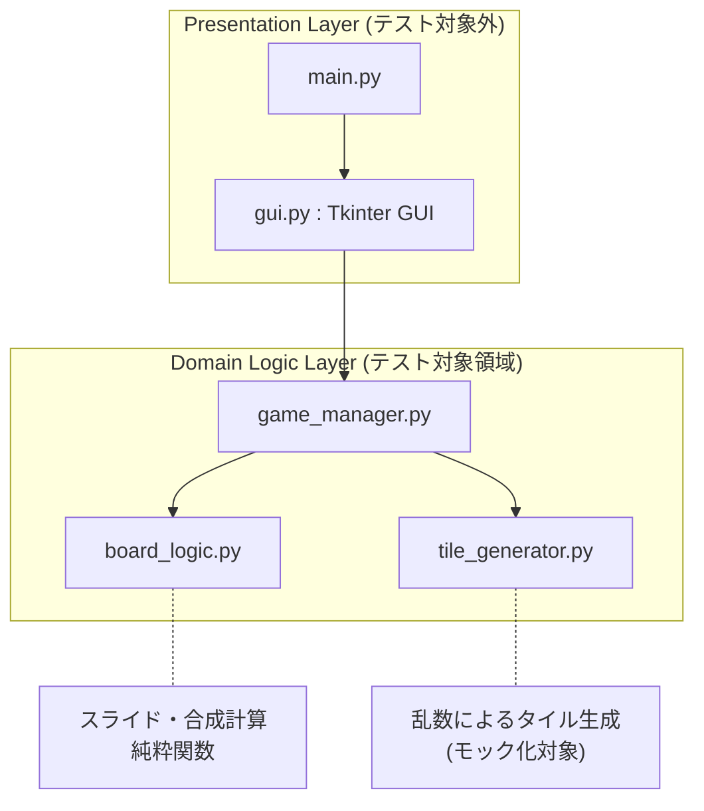
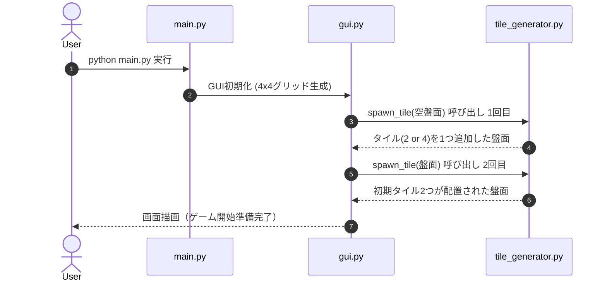
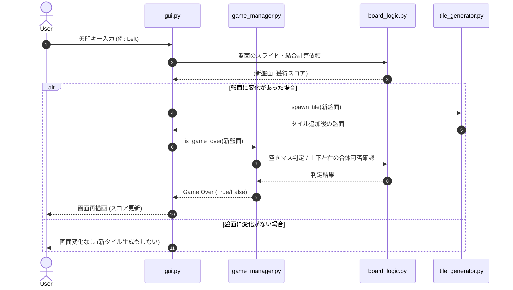

# 2048 システム詳細設計書 兼 ロジック仕様書

本書は、`test-design-2048` の内部構造および各モジュールの詳細仕様を定めたドキュメントです。
本ハンズオンでは**「UI（描画・入力）」と「ロジック（計算・判定）」が完全に分離（関心の分離）**されています。参加者はロジック部分の仕様を理解し、そのテスト設計・実装を担当します。

---

## 1. システム構成・コンポーネント図

システムは描画を担当するGUI層と、ゲームルールを管理するDomain Logic層に分かれています。

---

## 2. 動的プロセス（シーケンス図）

### 2.1 アプリケーション起動時のシーケンス

### 2.2 プレイヤー操作イベント発生時のシーケンス

---

## 3. モジュール別 詳細仕様書

### モジュール①: `src/board_logic.py`

盤面のグリッド計算を担当する純粋関数モジュールです。

#### 3.1 `slide_and_merge_line(line: list[int]) -> tuple[list[int], int]`

1行（長さ4の整数配列）を左詰めでスライドおよび同一数値の合成を行い、`(更新後の行, 獲得スコア)` のペアを返します。

* **入力仕様**: `line`: 長さ4のリスト（例: `[2, 0, 2, 4]`）。要素は `0`（空き）または `2` の累乗数。
* **出力仕様**: `(new_line, score)` のタプル。

#### 3.2 `is_board_full(board: list[list[int]]) -> bool`

4×4の2次元配列を受け取り、空きマス（`0`）が存在するかどうかを判定します。

---

### モジュール②: `src/tile_generator.py`

不確定要素（ランダム性）を含むタイルの生成モジュールです。

#### 3.3 `spawn_tile(board: list[list[int]]) -> list[list[int]]`

盤面の空きマスの中からランダムで1箇所を選び、`2`（確率90%）または `4`（確率10%）のタイルを生成した新しい盤面を返します。

---

### モジュール③: `src/game_manager.py`

ゲームの進行・終了条件をコントロールする高位モジュールです。

#### 3.4 `is_game_over(board: list[list[int]]) -> bool`

現在の盤面において、これ以上プレイヤーが上下左右どの方向にも動かせない状態（ゲームオーバー）であるかを判定します。
