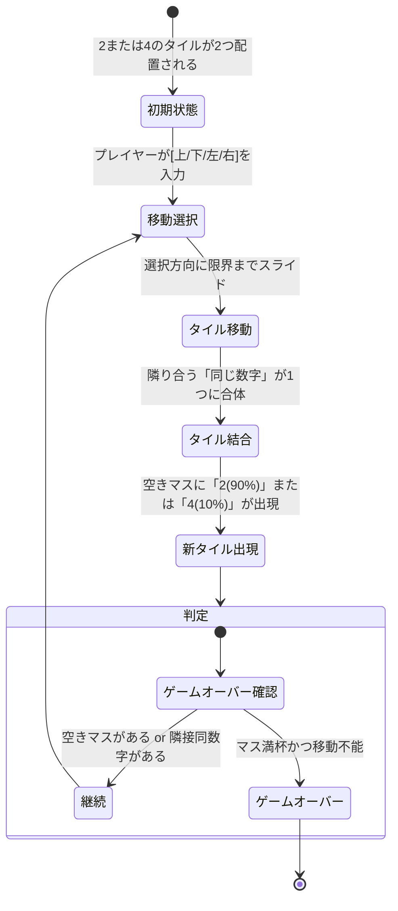
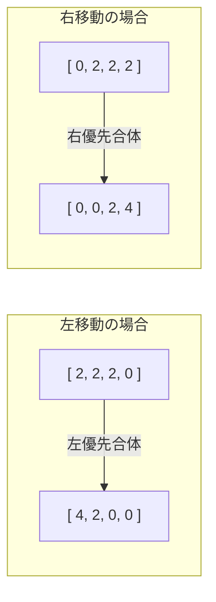

# パズルゲーム「2048」完全ルール＆仕様ガイド

本書は、本ハンズオンの題材であるパズルゲーム「2048」の基本ルール、マスの結合メカニズム、スコア計算方法を解説したドキュメントです。

---

## 1. 2048とは？

2048は、4×4のグリッド（16マス）上で数字の書かれたタイルの位置を動かし、同じ数字同士を合体させて「2048」のタイルを作り出すことを目指す、非常にシンプルな思考型パズルゲームです。

---

## 2. マスの結合（Merge）ルール

1回の移動操作において、タイルは指定された方向へ一斉にスライドし、以下の厳格なルールに基づいて合体します。

### ルール①: 同じ数字同士のみ合体

* 同じ値を持つ2つのタイルが衝突したとき、1つのタイルに合体して値が**2倍**（2+2=4, 4+4=8, ...）になります。
* 異なる値同士（例: 2 と 4）は合体せず、隣り合って並びます。

### ルール②: 1移動1結合の原則（連鎖防止）

**1回の移動で、1つのタイルが合体できるのは1度だけ**です。連鎖反応は起きません。

| 移動前 | スライド・結合処理 | 移動後 | 解説 |
| --- | --- | --- | --- |
| `[ 2, 2, 2, 2 ]` | 左移動 | **`[ 4, 4, 0, 0 ]`** | 左側の(2+2)で4、右側の(2+2)で4。一度に「8」にはならない |
| `[ 2, 2, 4, 0 ]` | 左移動 | **`[ 4, 4, 0, 0 ]`** | 左の(2+2)で4になり、もとからあった4と並ぶ |
| `[ 4, 2, 2, 0 ]` | 左移動 | **`[ 4, 4, 0, 0 ]`** | 右側の(2+2)が4になり、左の4と並ぶ |

### ルール③: 移動方向優先の合体

同じ数字が3つ並んでいる場合、**移動方向の先頭にあるペア**から優先して合体します。

---

## 3. スコア（得点）計算の仕組み

スコアは単に「タイルを動かした回数」ではなく、**「合体によって新しく生み出されたタイルの値の合計」** で計算されます。

### 得点計算の例

```mermaid
gantt
    title スコア加算の計算ステップ（1行スライド時）
    dateFormat X
    axisFormat %s

    section 移動前
    [ 2, 2, 4, 4 ] : 0, 1

    section 結合1
    2+2 = 4を生成 (+4pt) : 1, 2

    section 結合2
    4+4 = 8を生成 (+8pt) : 2, 3

    section 獲得スコア
    合計 +12pt 獲得 : 3, 4

```

| 結合アクション | 新規生成タイル | 加算スコア |
| --- | --- | --- |
| `2` + `2` を合体 | **`4`** | **+4 点** |
| `4` + `4` を合体 | **`8`** | **+8 点** |
| `1024` + `1024` を合体 | **`2048`** | **+2048 点** |
| 移動のみ（合体なし） | なし | **0 点** |

> **計算例**: 盤面全体で一回移動した結果、`2`+`2` $\rightarrow$ `4` が1つ、`4`+`4` $\rightarrow$ `8` が1つ同時に作られた場合、そのターンの獲得スコアは **$4 + 8 = 12$ 点** となります。
