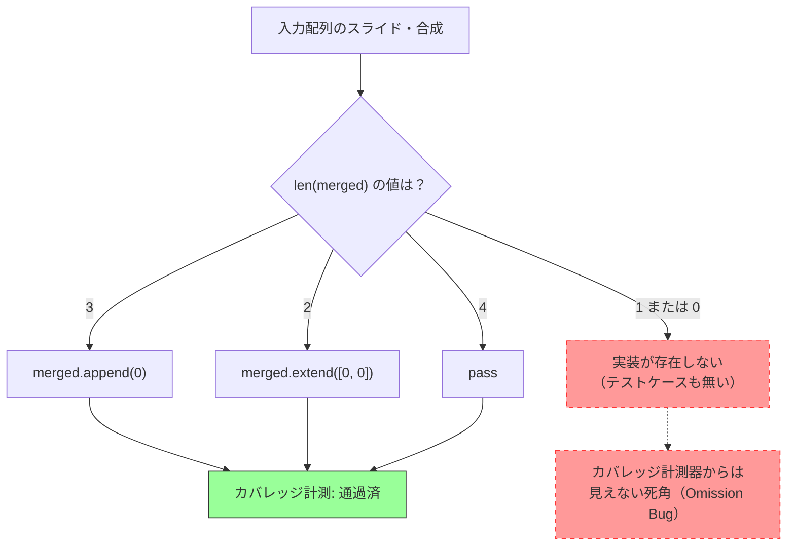

# カバレッジ100%の意味と限界（講師用解説資料）

Session 6の学習目的「カバレッジ100%＝バグゼロではないことを理解する」を直感的に伝えるための実例サンプルです。

## 1. カバレッジの罠（Omission Bug）

カバレッジツール（`pytest-cov`など）は、「**書かれているコードが**どれだけ実行されたか」を計測します。
逆に言えば、「**書かれるべきだったのに、書かれていないコード（実装漏れ）**」を発見することはできません。

これを体感するために、`slide_and_merge_line` のパディング処理（長さ4に調整する部分）にわざとバグを仕込んだコードを用意しました。

### 潜在的なバグを含む実装 (`buggy_board_logic.py`)
```python
    # 【バグ箇所】長さ4に調整する処理
    # 長さが1や0になる場合の実装が欠落している（Omission Bug）
    if len(merged) == 3:
        merged.append(0)
    elif len(merged) == 2:
        merged.extend([0, 0])
    elif len(merged) == 4:
        pass  # 何もしない
```

## 2. カバレッジ100%を達成してしまうテスト (`test_buggy_board_logic.py`)

以下の4つのテストケースを用意します。

1. `[2, 2, 4, 8]` (合成後長さ3) → `if len(merged) == 3:` を通過
2. `[2, 2, 4, 4]` (合成後長さ2) → `elif len(merged) == 2:` を通過
3. `[2, 4, 8, 16]` (合成後長さ4) → `elif len(merged) == 4:` を通過
4. `[2, 2, 2]` (入力エラー) → `raise ValueError` を通過

このテストセットを実行すると、すべての分岐（Branch）と行（Statement）が実行されるため、**カバレッジは100%** と報告されます。

しかし、`[2, 0, 0, 0]` （合成後長さ1）や `[0, 0, 0, 0]` （合成後長さ0）を入力すると、配列の長さが補填されず、長さ4の配列を期待するゲームロジックは後続処理でクラッシュします。

## 3. なぜバグがすり抜けたのか？（図解）

カバレッジ測定器の視点では、コード上に存在しない `len(merged) == 1` の世界は見えません。



### メッセージ
「カバレッジが低い（未テストのコードがある）」ことは問題ですが、「カバレッジが100%だから品質が高い」と盲信してはいけない。
テスト設計（Session 1〜5で学んだ同値分割や境界値分析）で「どのような入力が必要か」を人間の頭で考えることこそが、この「見えない死角」をなくす唯一の方法です。
